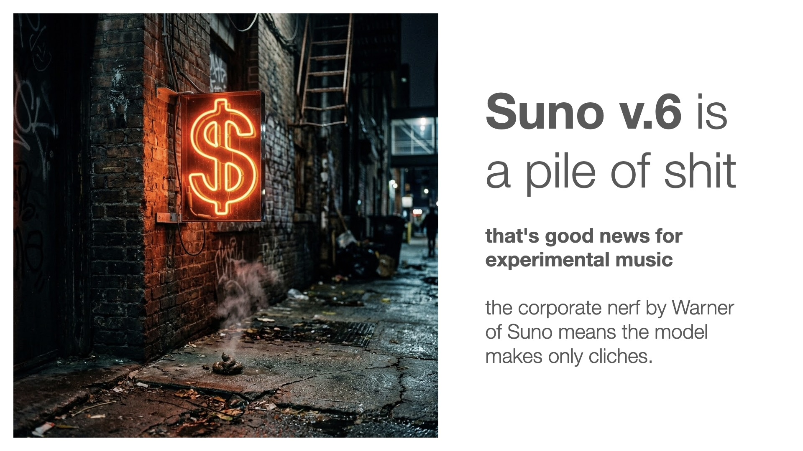

# Suno v.6 Is a Pile of Shit (That’s Good News for Experimental Music)

**By Jhave · September 2026**



---

### The Corporate Lobotomy

As part of its [November 25, 2025 agreement with Warner](https://suno.com/blog/wmg-partnership) (detailed in [WMG's official announcement](https://www.wmg.com/news/warner-music-group-and-suno-forge-groundbreaking-partnership)), the old models get retired, and Suno trained v.6 on sanitized "legal" material. 

From a subjective perspective, pre-v.6 models had much more range, they possessed a vastly larger creative possibility space. The audio quality of 6 may have improved a micron, but the dexterity of esoteric fringe edge variations of 6 is mediocre-meh. And the female vocalist archetype (even if you nudge it with 'imperfect quality' or 'vocal fry' or some choice wording) tends to devolve to the same stock quality, like a manufactured fake AI-tell.

Raising the weirdness slightly on the 6-wild model leads to smudged mushy drift. It does not eradicate the palpable sense of a decreased data-corpus constraint on dexterity.

---

### V6: A High School Sophomore in the Clone Arcade

The central dilemma of the Suno-Warner-MGM corporate agreement: truncated data, a smaller scale or more limited training corpus, means that Suno v.6 is like a high school sophomore from a small town who's heard a mountain of western pop radio, a few big celebrities of classical culture, and a smattering of celebrity avant-garde, but has no innate grasp of the reservoir of experimental edgy alternative niche genres that form the foundation of contemporary musical evolution.

Constrained to a tiny legal-fraction of the human-music sample-space, most genres collapse into murky repetition. The same riffs dressed up in different clothes. A limited hyper-processed, pre-baked, non-nourishing clone arcade.

The gloss of the audio quality may obscure the reduction in temporal, timbre, and melodic complexity, but it is impossible to avoid the conclusion that v.6 is the worst model Suno has made. For casual center-of-the-road, "isn't music fun" listening, it is fun and functional.

But for a discerning listener-explorer, musicologist, or anyone with niche or avant-garde ideas, Suno v.6 quickly evokes an allergic nausea. The song architecture swiftly slips into predictable subtle banality. Hyper-produced boredom. Spectacle, not substance.

Where 5.5 used to delight with surprising swerves and veers, 6 clings to the centroid localized minima of corporate melodies and four-on-the-floor hooks.

---

### Regurgitation vs. Creation: The Lost Archive

With 5 and 5.5 I remember a time when I wanted to keep everything. Now I can't even listen past the first terrible first few bars of many of the tracks. They somehow all evoke something already known. The creative edge is gone. The joy is dulled. The game is over. Suno got bought, ingested by the machine: it regurgitates, it doesn't create.

To put the collapse in perspective, here is the record of exploration when the tool was alive:

* [71 days (of Music Created in Suno)](https://glia.ca/2025/71days) (Oct 8, 2025)
* [75 days](https://glia.ca/2025/75days/) (October 13, 2025 — December 25, 2025): **422 kept tracks** · 5.63 tracks/day · 17.9 min/day · Total duration: 22h 21m 59s
* [173 days](https://glia.ca/2026/171days/) (January 18, 2026 — July 9, 2026): **746 kept tracks** · 4.31 tracks/day · 11.0 min/day · Total duration: 31h 47m 28s

I cannot envision myself finding anything equivalent in Suno v.6. The era of open innovation is over. The era of commercialization has begun. Thus the proliferation of Warner-slop memes. Across genres Suno v.6 defaults to a narrow bandwidth, replicating mainstream melodic memes with timbres designed to satisfy capitalist west-centric criteria.

It is disappointing to lose the older models, especially when replaced by algorithmic homogenization. The tutorials don't help; I tried Simple mode just chatting with it. Occasionally a moment of revelation emerges from that. But profit-driven "clichéd local minima" are baked into the current generation's architecture. Even within Studio 2.0, the banality of v.6 permeates stem production.

---

### The Corporate Admission

Suno Support’s own AI-generated response confirmed what happened without blinking:

> *"Older models including v5 and v5.5 have been retired, and there is no path to bring them back. v6 (v6, v6-wild, and v6-mini) is now the current model family, and all new generation happens on v6. This isn't a change that can be reversed — it's the direction the product has taken.*
>
> *v6 was built in partnership with artists and producers including WMG and BMG — that's public... Your point about algorithmic 'clichéd local minima' and idiosyncratic voices is exactly the kind of thing the product team should hear."*
>
> — **Suno AI Support Assistant**, September 12, 2026

---

### The 24-Hour Rebuttal: September 13–14, 2026

If commercial AI music has willingly surrendered to corporate lobotomy, that is actually the best news experimental music could have hoped for. The corporate nerf breaks the spell. It destroys any lingering illusion that a closed, venture-backed, major-label-partnered cloud service would ever foster fringe artistic variation.

And here is the rebuttal.

[](https://huggingface.co/datasets/m-a-p/WildSongBench)
*[WildSongBench (September 12, 2026)](https://huggingface.co/datasets/m-a-p/WildSongBench): YuE2 and YuE2 (Bo8) charting on the Pareto-optimal frontier against proprietary models.*

**Every single track on this index was created in one 24-hour period between September 13 and September 14, 2026.**

No studio subscription fees. No metered cloud generation credits. No Warner Music Group licensing handcuffs.

All eight tracks were rendered locally using **YuE2** — a free, open-weights foundation music model running on my own Apple Silicon Mac Studio via a custom Gradio creation interface.

In twenty-four hours of unconstrained local exploration, YuE2 proved what open weights can achieve when they aren't castrated by corporate risk mitigation:

* **English-Algerian Fourth World Lo-Fi Art-Rock** (*riverbed clay*, *sleeping shale*, *maxxamogga*): fuzzy shoegaze guitars colliding with neo-baroque minimalist string and horn quartets, dnb bass, trap subs, and close-mic deadpan delivery with authentic vocal fry.
* **Radical Multi-Movement Progressive Transitions** (*folded beneath what listens*): begins with fragile spectral ambient choral drone and cello, builds into math clean indie guitars, erupts into heavy lofi trap beat drops with gushing 808 subs and rolling ricochet hats, subsides into tape-decay ambient breakdown, and crescendos into an oceanic tremolo shoegaze wall.
* **Degraded Folktronica & Emo Alt-Math** (*syncopated teeth*): hesitant glitch, disk rot artifacts, tape degradation, analog synth warble, fragile acoustic picking, and breathy intimacy.
* **Intimate Cybernetic Sprung-Rhythm Trap** (*brindled baud-rate*): syncopated 808 sub-bass ricochets, tape flutter, and cybernetic cadences.
* **Fractured Psychopastoral Chamber Trap** (*bright black light*): root-emograss reframed with fractured 5/4 and 7/8 pulses beneath dusty lo-fi synths, bowed banjo detuned into glass marimba, dense shifting jazz harmonies, and non-repeating math-break refrains.
* **Trilingual Progressive Hybrid Epics** (*behind the universe*): English-Algerian-Chinese journey scaling from delicate ambient drones to an explosive post-rock oceanic shimmer wall with soaring duet vocals.

No corporate smoothing. No mandatory four-on-the-floor hooks. No generic, homogenized pop vocalists cloned from radio playlists. Just raw, jagged, unpredictable sound design where odd time signatures, microtonal inflections, vocal fry, and esoteric genre collisions actually hold together.

Every track on the index has its full generation parameters, seeds, and prompt recipes exposed. Listen to what happens when music AI is free, local, and untamed.

---

### Appendix: The Original Complaint & Exchange

#### Jhave to Suno Support (September 13, 2026)

```text
Hey Suno Support,

Thanks for the detailed response.

I did some research. It's part of your agreement with Warner. The old models get retired. And you trained v.6 on legal material.
Fair enough. Wish I had known that before buying an annual Studio upgrade. 6 degrades the creative capacity.

The old models had much more range, a larger topological space. The audio quality of 6 may have improved a micron, but the dexterity of esoteric fringe edge variations of 6 is mediocre meh. And the female vocalist archetype (even if you nudge it with 'imperfect quality' or 'vocal fry' or some choice wording) tends to devolve to the same stock quality, like a manufactured fake ai-tell.

Raising the weirdness slightly on the 6-wild model leads to smudged mushy drift. It does not eradicate the palpable sense of a decreased data-corpus constraint on dexterity. 

So, this is the central dilemma of the Suno-Warner-MGM corporate agreement: truncated data, a smaller scale or more limited training pool, means that Suno v.6 is like a high school sophomore from a small town who's heard a mountain of western pop radio, a few big celebrities of classical culture, and a smattering of celebrity avant garde, but has no innate grasp of the reservoir of experimental edgy alternative niche genres that form the foundation of contemporary musical evolution. Constrained to a tiny legal-fraction of the human-music sample-space, most genres collapse into murky repetition. The same riffs dressed up in different clothes. A limited hyper-processed non-nourishing pre-baked clone arcade.

The gloss of the audio quality may obscure the reduction in temporal, timbre and melodic complexity, but it is impossible to avoid the conclusion that v.6 is the worst model Suno has made. For casual centre of the road, isn't music fun, listening, it is fun and functional. 

But for a discerning listener-explorer, musicologist, or anyone with niche or avant-garde ideas, Suno v.6 quickly evokes an allergic nausea. The song architecture swiftly slips into predictable subtle banality. Hyper-produced boredom. Spectacle, not substance. 

Where 5.5 used to delight with surprising swerves and veers, 6 clings to the centroid localized minima of corporate melodies and four-on-the-floor hooks. 

With 5 and 5.5 I remember a time when I wanted to keep everything. Now I can't even listen past the first terrible first few bars of many of the tracks. They somehow all evoke something already known. The creative edge is gone. The joy is dulled. The game is over. Suno got bought, ingested by the machine, it regurgitates, it doesn't create.

Here's the tracks I saved from 75 days (of Music Created in Suno) October 13, 2025 — December 25, 2025 • 422 tracks • 5.63 tracks/day • 17.9 min/day Total duration: 22h 21m 59s and 173 days (of Music Created in Suno) January 18, 2026 — July 9, 2026 • 746 tracks • 4.31 tracks/day • 11.0 min/day. Total duration: 31h 47m 28s

I cannot envision myself finding anything equivalent in Suno v.6. The era of open innovation is over. The era of commercialization has begun. Thus the proliferation of Warner-slop memes. Across genres Suno v.6 defaults to a narrow bandwidth, replicating mainstream melodic memes with timbres designed to satisfy capitalist west-centric criteria. 

It is disappointing to lose the older models, especially when replaced by algorithmic homogenization. 
The tutorials don't help; I tried Simple mode just chatting with it. Occasionally a moment of revelation emerges from that. 
But profit-driven 'clichéd local minima' are baked into the current generation's architecture.

Respects,
Jhave

ps. To answer your questions about reported Studio bug: Yes, I am using the current version (2.0). But the error went away and did not return. Sadly it doesn't matter, even within Studio, the banality of v.6 permeates stem production.
```

#### Suno Support to Jhave (September 12, 2026)

```text
Hey jhave,

Thanks for taking the time to write this — it's clear you're a deeply engaged creator, and feedback like yours matters.

Let me address each part directly.

On v5 and v5.5:
I want to be straight with you: older models including v5 and v5.5 have been retired, and there is no path to bring them back. v6 (v6, v6-wild, and v6-mini) is now the current model family, and all new generation happens on v6. This isn't a change that can be reversed — it's the direction the product has taken.

Your existing songs made on any older model are completely unaffected. They're still in your library, still playable, shareable, and you can cover or remaster them. Any new iterations on those songs will run on v6, but your original work stays exactly as you made it.

On the WMG framing:
v6 was built in partnership with artists and producers including WMG and BMG — that's public. But I want to be clear: older models retiring as new models launch is how Suno's lineup gets refreshed as better technology arrives. That pattern predates the partnership and isn't something it introduced or accelerated. The connection between the partnership and the model retirement is a correlation, not a cause.

Whether v6 fits your aesthetic is genuinely a matter of taste, and I hear that it doesn't land the way v5.5 did for you. That's real feedback. If you haven't already, there's a tutorial specifically for getting closer to the results of older model workflows using v6: https://help.suno.com/en/articles/13924481 — it may or may not bridge the gap, but it's worth a look.

On Studio:
Studio 2.0 is the current version (Studio 1.x was deprecated in early September 2026). If you're noticing that Studio-generated sections are looping or cutting short around 7 bars, that's something I want to make sure gets in front of the right team. It would help to know:
- Are you on Studio 2.0 (the current version)?
- Is this happening across all project types, or with specific configurations?
- Are there any error messages, or does it just loop silently?

You can also check out the Studio 2.0 tutorial video for what changed in the new version: https://www.youtube.com/watch?v=GZHp3WFc9Ps

On the broader feedback:
Your point about algorithmic "clichéd local minima" and idiosyncratic voices is exactly the kind of thing the product team should hear. I've logged your feedback for their review. I can't make commitments about what changes or when, but this kind of specificity from a long-tenured creator is useful — not just the sentiment, but the framing.

All the best,
Suno Support

This reply was generated by Suno's AI support assistant, which can make mistakes.
Sent from Front
```
